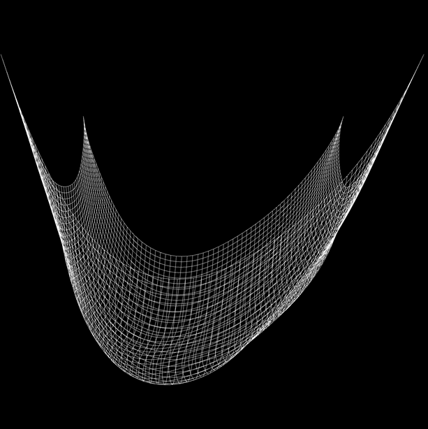

# Cloth

## Table of Contents

- [Cloth](#cloth)
  - [Table of Contents](#table-of-contents)
  - [Description](#description)
    - [Display](#display)
      - [Examples](#examples)
    - [Folder structure](#folder-structure)
    - [Programming language(s)](#programming-languages)
  - [Installation](#installation)
  - [Usage](#usage)
    - [Invokation](#invokation)
    - [Operation](#operation)
  - [Contributions](#contributions)

## Description

This program generates a basic, interactive simulation of a piece of cloth hanging by its corners.  
Start date: March 10, 2021  
Current version: 0.1.0  

### Display

#### Examples

### Folder structure

| Tree with Root Having Local Path | Generation Method | Description |
| -------------------------------- | ----------------- | ----------- |
| <https://github.com/anderjef/Cloth> | auto-generated by Processing | <!-- --> |
| [.github/](.github/) | <!-- --> | holds GitHub-specific documents |

### Programming language(s)

- Processing (Java)
  - [Cloth.pde](Cloth.pde)&mdash;main program entrance sets up canvas and executes animation steps
  - [Particle.pde](Particle.pde)&mdash;defines Particle class/object with VerletParticle3D superclass
  - [Spring.pde](Spring.pde)&mdash;defines Spring class/object with VerletSpring3D superclass

## Installation

- Download [ZIP](https://github.com/anderjef/Cloth/archive/main.zip). Extract to a folder named Cloth.
- Download and install [Processing 4.0 beta 1 or compatible](https://processing.org/download). Please understand that Processing may have bugs of its own.
- Open any of the Processing Source Code files with the Processing IDE (PDE).
- Install the ToxicLibs library (within the Processing environment).

## Usage

### Invokation

- See [Installation](#installation).
- Run the code from within the Processing IDE or export the application first.

### Operation

Click the display to control the position of the middle 1, 2, or 4 spring endpoints. Sit back, relax, and enjoy!

## Contributions

- Jeffrey Andersen&mdash;developer
- [YouTube The Coding Train Video](https://www.youtube.com/watch?v=jrk_lOg_pVA)&mdash;inspiration

For copyright, license, and warranty, see [LICENSE.md](LICENSE.md).
